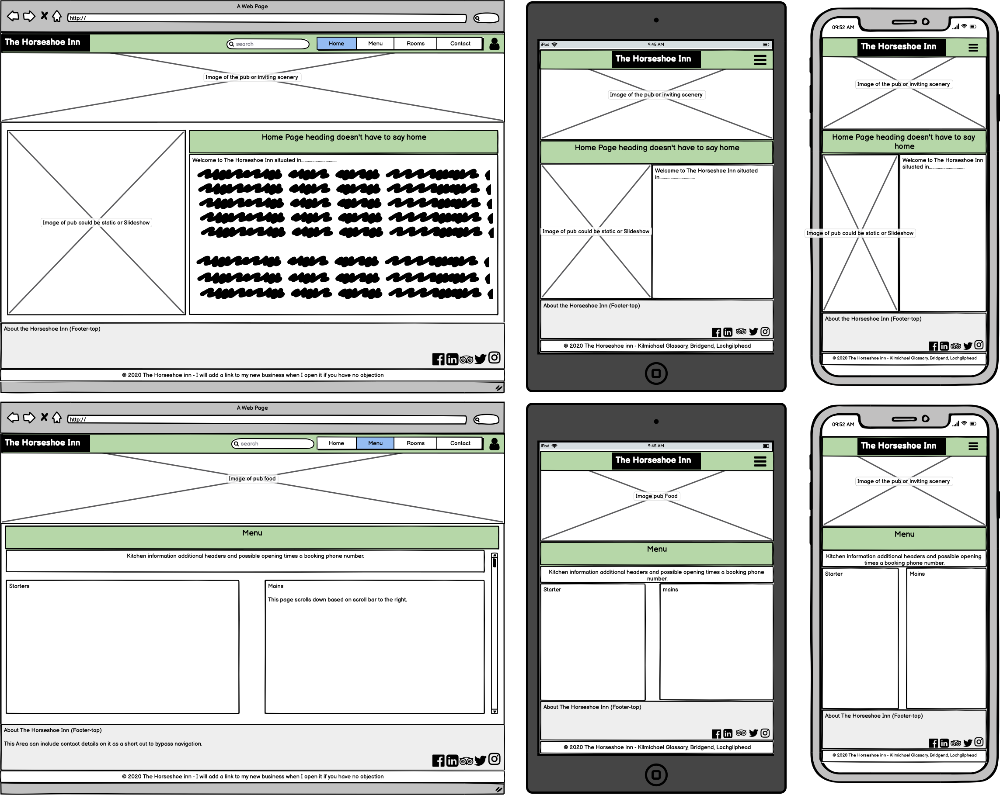
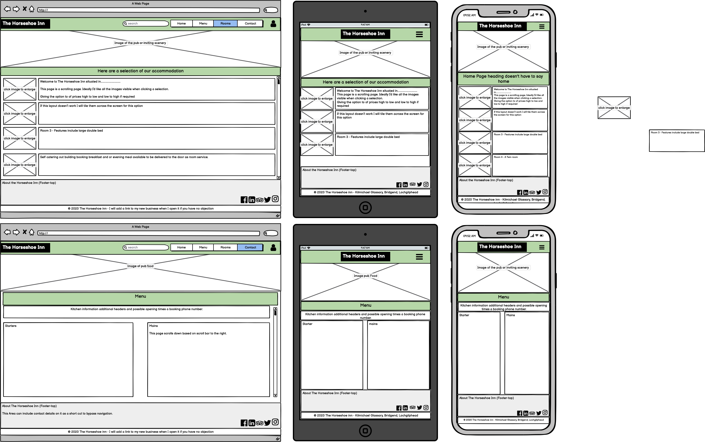
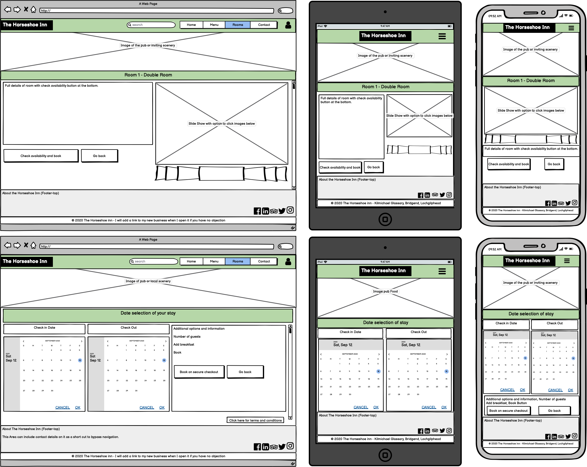
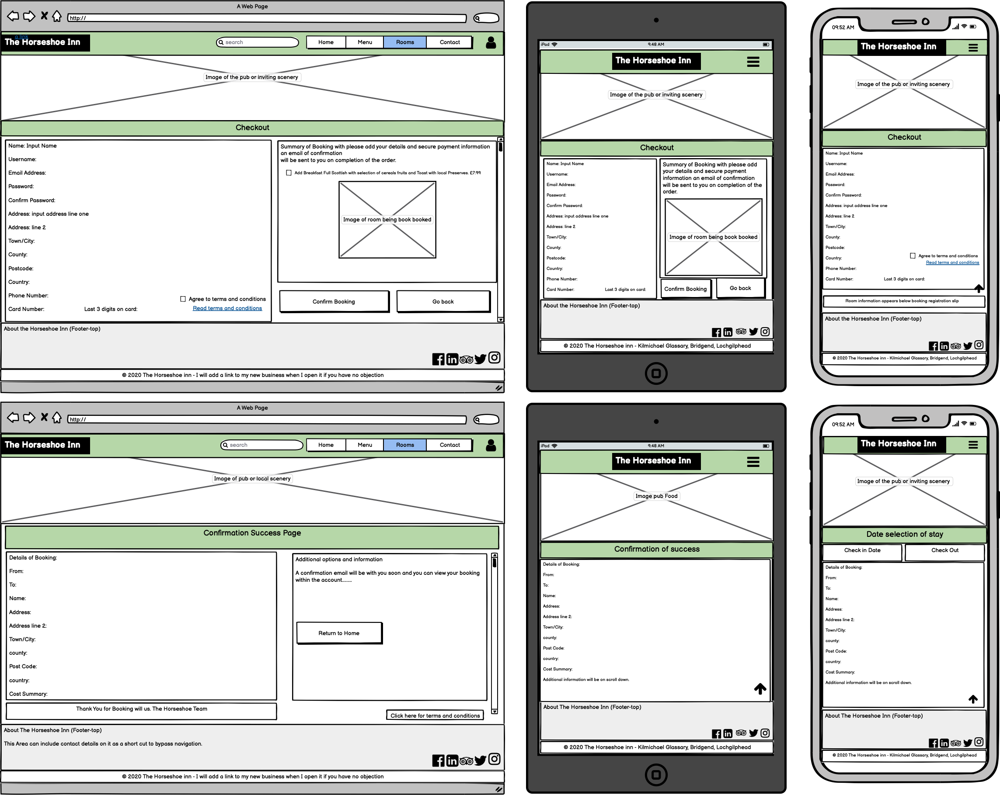
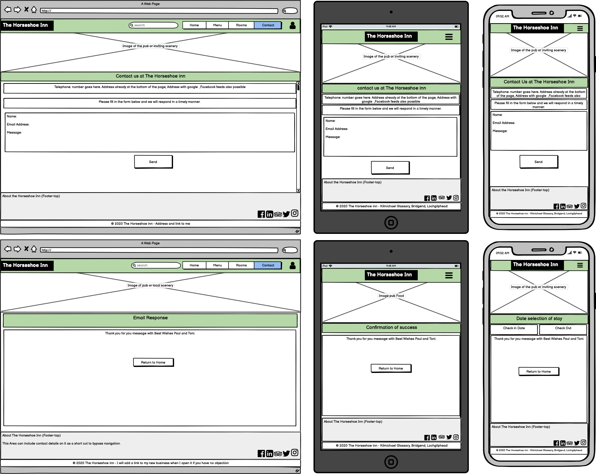
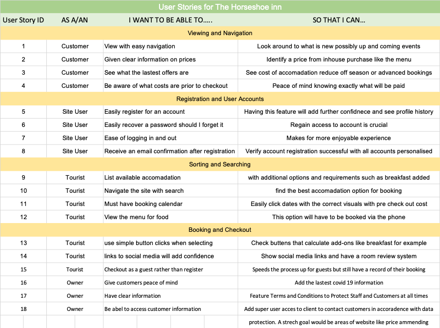

# Robin Collins Final Landmark Assignment Django Full Stack

## The Horseshoe Inn

# Project Purpose

### This is a real pub my friend Paul and his partner Toni purchased in July 2020 amid a pandemic
This is a genuine requested website and will be used once submitted for assement and I am aware
that I will require to use a branch should any urgent updates be required.

With all the drama good and bad, Paul and Toni have experienced along the way, they have gained media attention
from Channel 5 who are now making a documentary of the pub. Paul and I had discussed could 
potentially give my career some exposure also. 

I therefore need to call on all my strengths and work hard on my weakness in delivering a high scoring assignment 
that I can and more importantly my friend can use to benifit and take a lot of hard work out of his business.

If the documentary proves popular The Horseshoe Inn will require a fresh and inviting website that is not over
complicated and easy to navigate with a secure but easy booking system.

The hospitallity industry has suffered like many in 2020 and needs a boost. It will also have key Information
of updates to current rules and regulating and a website with social media links where immediate update are not
possible on the website.

I'd like to think that this website is helping a commuinty and repair the tourism and hospitallity sector that has suffered
possibly irreparable damage in 2020 in the UK with thousands of closures and job losses.

Additional information such as a Menu page and what to do in the area may appeal to visitor to stay longer benefiting
the establishment.

Early cancellation will be refunded with bookings cancelled within 48 hours will lose a deposit and 24 hours full amount.

# UX design

A room booking system is the main requirement, with easy date select and checkout with the option to add extras
for instance breakfast. By having the option to register will allow the Inn to have a database of guests. therefore
with a checkbox on registration they can recieve quarterly/monthly news letters or be informed of last minute room
availability.

# Wireframes

Home & Menu

Rooms & Romms Scrolled down

Room with room selected & Date Booking Select

Room enter details booking with payment & Booking Confirmation

Contact page & Respose to webform message page

Terms & Conditions and a Covid-19 public information for rules and regulations

# User Stories

## Usability and Visual Impact:

# Suitability for purpose

# Navigation

# Ease of use

# Information Architecture

# Defensive Design

## Layout and Visual Impact:

# Responsive Design

# Image Presentation

# Colour scheme and typography

## Code Quality:

# Appropriate use of HTML

# Appropriate use of CSS

# Appropriate use of JavaScript

# Appropriate use of Python

# Appropriate use of the template language

# Appropriate use of Django

## Application Features:

# App logic

# Cross-app logic

# E-commerce

# Authentication and Security

# Software Development practices:

# Directory Structure and File Naming

# Version control
security not putting SECRET_KEYS in wrong place using config vars in Heroku

# Testing implementation

# Testing write-up

# Technologies Used

* Django 
* Bootstrap - https://getbootstrap.com/
* mdbootstrap - https://mdbootstrap.com/docs/jquery/navigation/footer/

# Comments and Diary

In the early stages of development I was having linking issues with the Readme file. Basically I wanted
the best assignment possible with the best readme therefore wanted to add images to the readme rather
than have them stored in a Wireframes folder. I had been shown how impressive some of these files are
and it left me inspired.

It is something I hadn't learned on the course so decided to research into this and successfully found
videos of this on YouTube. However I think the video was slightly dated and got a few errors with the
links not working correctly and I decided to edit within Github rather than GitPod. This was something
I hadn't done before so I did make 2 or 3 commit errors by not adding a coment in the box at the bottom
of the page and the preview option until my 4th attempt.

I contacted tutor support as concerned these errors would go against me hence I am documenting them
now to make the assor aware of my errors which I can say have now been resolved. Despite all of this I
found it a great learning curb as worked out alternate ways to update and alter using git commands and
editing from Github directly.

In week two of development my friend sent me images of The Horseshoe Inn since it had been refurbished
however these images I recieved were very small images suitable for smaller devices but not the large
screens. However, due to his workload he has been unable to get the images to me and further deadlines
get missed due to how busy he is that after a week I have decided to continue with image placers that
fill the gaps until he has time to fullfil my request. I am due to visit in late October 2020 but feel that
this assignment needs to be completed before then as good practise for the industy.

Furthermore, while working on this assignment I have also undertook the task of building another Django 
website for another customer my niece for her vegan cake shop Vixen's Vegan Delights. I did this as I 
knew the amount of pressure my friend is under buying a pub during a pandemic and making it work knowing 
potentially it could go very wrong. To assist him I have plenty of ideas to support him on the way to his
and my successes.

02/10/20
I have found out my deadlines and after a chat with my mentor he has advised me not to take on the huge
task of simoutaniously building 2 large websites as just one was pointed out to me by student services as
a behemoth. I have also been in contact with Paul again at The Horseshoe Inn and he agrees that the
work load for both of us is vast. This project will remain the priority and I will continue with 
Vixen's Vegan Delights after I am closer in completing this assignment.
Furthermore, I am due to travel back to Scotland for further meetings and include terms and conditions
and take proffessional pictures of the establishment. My cut off day for the assignment is 16th December
however, I hope to submit the assignemt around the 1st November to allow me to assist other customers 
and clients I have gathered.

# Data store integration

# Deployment implementation

# Deployment write-up

 
